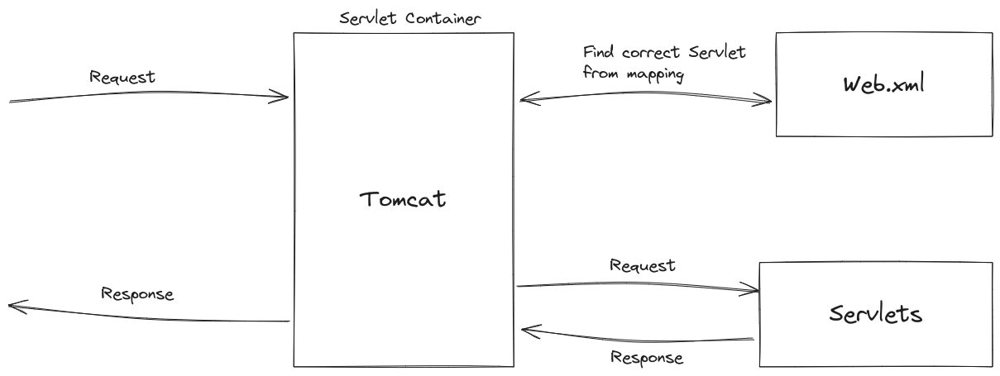

# Intro to Spring Boot

## Servlets

Before Spring and Spring Boot, people used to use "Java Servlets" and they used to be a headache to work with. However they formed the foundations of building web applications and Spring and Spring Boot rely on the same foundation.

:::important
A Servlet is a Java class that handles client requests, processes them and returns the apt response.

A Servlet Container manages Servlets.
:::

When working with servlets, there used to be 2 main components:

1. The actual servlet code which defined functionality
2. The mapping of the endpoints to the servlets so the servlet container would know which servlet to invoke.

## Spring Framework (Spring MVC)

The Spring Framework was started off as a way to solve many issues with servlets. Some these new features are:

- Removal of web.xml

  - web.xml eventually became too big to manage in many applications, affecting scalability and reliability.
  - Spring Framework introduced annotations based configuration.

- Inversion of Control

  - IoC is a flexible way of managing object dependencies and its lifecycle (through Dependency Injection).
  - This simplifies dependency managment in the application and makes it easier to mock dependencies when unit testing.
