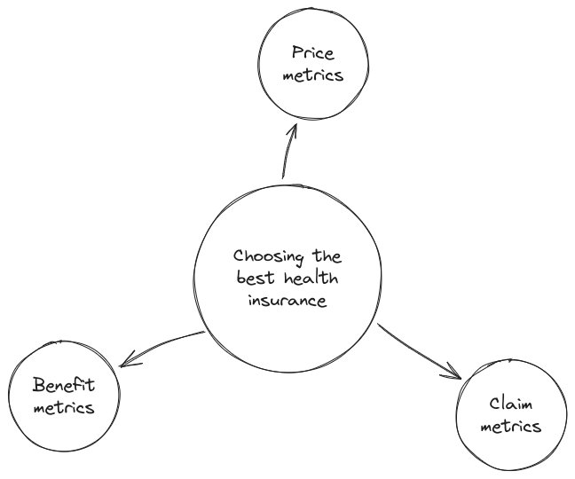

# My Financial Handbook

Notes on earning, saving, investing and spending money.

:::important
This handbook is a collection of notes and ideas for my own learning and is not meant to be taken as financial advice. The content may be incomplete or inaccurate. Please don’t rely on it for decisions—always consult a professional. I’m not responsible for any outcomes from using this information.
:::

## A system for your finances

Looking after your finances is not a matter of choosing the perfect thing to invest in. It is a matter of building cashflows that allow you to support and sustain your lifestyle in the long run. A good system of cashflows provides you a safety net to protect you in case of emergencies (illness, job loss or death of a salary-earner). This allows you to simply get on with your life instead of remaining stuck and worried about money.

As suggested above, managing your money is not only about managing your investments, but also various types of insurance and making sure you have money in hand for any upcoming expenses. Even within investments, there are many ways you can divide up your money. Each investment product has their own purpose and one needs to understand exactly what each product is meant for.

Along the way, we clear out any jargon we often find in the world of investing.

## Cashflows

The first thing we need to do to start managing our money is to track it, because there are many ways in which we can receive money and many many more in which we can spend it all away. Some of these incomes/expenditures are regular while some are not. Demarcating the exact amounts of money you earn, spend and invest is important as it reduces your mental load of making frequent monetary decisions.

If you're someone who tends to overspend, marking off some part of your salary for investing and whisking it away to a seperate bank account before you can spend it may be a good idea. If you maintain 3 seperate bank accounts for saving, spending and another one where you get your income, you can move your money to the right spot in just 10 minutes after your salary drops. Figuring out exactly how much money you need in the spending account is something you need to slowly find out over a matter of 2-3 months.

Some good spending habits are:

<table>
<tbody>
    <tr>
        <th>Where you're putting your money</th>
        <th>% of your monthly take home income</th>
    </tr>
    <tr>
        <td>Living costs</td>
        <td>&lt; 45 - 50%</td>
    </tr>
    <tr>
        <td>EMI Payouts</td>
        <td>&lt; 25 - 30%</td>
    </tr>
    <tr>
        <td>Savings</td>
        <td>&gt; 15 - 20%</td>
    </tr>
</tbody>
</table>

## How to deal with the savings money

Once you have money to save, it is important to decide where and how to save the money. The money you save is not only for pure investment instruments, but you must also use it to insure your future.

Some common ways to allocate your savings are (this is not an exhaustive list):

- Emergency fund
- Health insurance
- Life insurance
- Short term investments
- Long term investments
- Retirement fund

We look at some of them in detail in the following subtopics and others in even more detail in future topics.

### Emergency Fund

Something that often stops people from investing long-term is the fear of an emergency. Things like medical emergencies and death of an earning family member may be taken care of by insurance (we will look at that soon), but there are somethings that might require reserve money at a short notice like a job loss. This is where an emergency fund is helpful.

To form an emergency fund you need to know two things:

1. How much do you spend in a month? Include rent, EMIs, fees, insurance premiums...basically everything.
2. How many months of protection do you need? A good estimate will be 6 months to 2 years depending on your situation. If you do not have a lot of responsiblities (or are one of multiple earners in your family), then 6 months might be enough. But if you're supporting many people, then going upto 2 years of emergency fund is advisable.

So one of the first things you should do is start building your emergency fund based on the above 2 parameters. That should be the only focus of the money in your investment account. When an emergency does arrive, once you're back to earning money, you should focus on rebuilding your emergency fund.

But where do you put it?

The ideal place to put it would be somewhere where the money is making some sort of interest (atleast close to beating inflation, if not beating it) while also being easy to access without any loss in value. Just keeping it in your bank's saving deposit is not a good idea...as it just doesn't provide you with any noticeable returns.

Bank Fixed Deposits (FDs) are a good idea. Especially since we can now simply withdraw money using a few taps on our phones. Make sure the FDs you create are granular enough that allows you to only utilise some part of the emergency fund if that is the scenario. Some banks offer flexi-FDs to allow you to withdraw only the amount you need, rather than losing the interest on the entire fund amount.

Short term debt funds are mutual funds that can be used if you understand mutual funds well. I don't (at the time of writing). They are said to offer better returns, be more liquid and have greater tax benefits than FDs.

:::warning[TODO]
Finish this part when you understand MFs better
:::

### Health Insurance

This section covers some basics of how you why you need medical cover, how much do you need and how to go about selecting the best policy for you and your family.

A medical cover reduces the risk of having to spend a lot of money on medical expenses by regularly paying a small amount called premium. For the price of the premium, if you face a medical emergency, the insurance company has to pay on your behalf. Hospital and medical costs are getting expensive, and having to pay large amounts of money suddenly can be difficult. That is why medical insurance is necessary.

If you're someone like me, your job probably offers you medical insurance. But do you need your own policy, apart from the one available at your job? Yeah... you do. Your job's medical insurance is only available till you're employed. If you lose your job, or have to quit your job due to medical reasons, the cover goes too. Additionally, your job's medical cover may not suit your needs and preferences in terms of sum assured, provided benefits, terms and conditions, dependant coverage etc.

So how much of a cover do you need?

The answer to this depends on your a few factors like where you live, and the kind of hospital you wish to visit in cases of medical emergencies. It might be a good idea to inquire around about the facilities and hospitals available around, and the kind of services they offer.

#### Choosing health insurance

Choosing the best health insurance is a very involved process. Not only do you have to look at the price of the policy, but you also have to understand the benefits covered by the policy. Apart from this, you also have to research the TPA experience and the claim rejection rate.

**Price**: 
Since the premium of health insurance changes as you age, you should not only compare insurance providers in terms of price right now, but also in terms of price 10,20,30 years down the line. This gives you a better estimation of the price of the health insurance over many years.

**Benefits**: 
This is not easy to deal with as the benefits offered by companies have many technicalities and conditions. Some these technicalities you should know about are:

- Co-pay clause: This just means that you have agreed to share some percentage of the hospital bills with the insurance company. Obviously you do not want this clause on your insurance. Be absolutely sure you are not agreeing to this clause, even if they try to slip it in. A similar term to co-pay is "deductible" which is a fixed amount you agree to pay before the company starts to pay the insurance claim.

- Pre-existing disease clause: If you have a pre-existing disease (like for example diabetes), you may or may not be able to get insurance. Companies can decide if they want to offer you insurance. However, many insurance companies also have a pre-existing disease (PED) clause where they may not cover these PEDs for a period of 4 years. Hiding a PED from an insurance company can be grounds of claim rejection and even policy cancellation. Insurance companies are also known to reject completely unrelated claims on the grounds that you have some other PED that you did not disclose. So make sure when you are buying a policy, you include a thorough medical history. Even if the definition of a PED is lesser in your insurance, make sure you include everything you can remember in your health declaration. This gives them no excuses to reject claims later.

- Waiting periods: When you start a health insurance policy, the cover does not start immediately. There are many types of waiting periods when it comes to health insurance. An accident is usually covered from day one of the health insurance policy. There is also an initial waiting period (usually 30 days), after which all kinds of infections are covered. There may also be waiting periods for surgeries or organ-specific diseases. PEDs usually also have a seperate waiting period.

- Sublimits: Policies often have sub-limits that say some parts of your expenses can only be upto a certain value. For example, one condition that is often present in policies is that room rent per night can only be upto 1% of the sum insured. So if you have a policy of 5 lakh rupees, your room rent can only go upto 5000 per night. Any additional expenses will have to be borne by you. The condition is sometimes ever deeper than that. Since hospital often charge for other things in proportion to the room quality (and hence room rent), some insurers may pay back only the proportion of the claim that is claimable. So if you have a room rent limit of 2k per night and you decide to take a room worth 4k per night, depending on the rules of the policy, they may just decide to pay you 50% of the total cost incurred during the hospitalization.

- Exclusions: Policies may exclude certain conditions, procedures and treatments. Dental, pregnancy-related and cosmetic procedures and complications are common exclusions.

- Pre and post hospitalization cover: There are often costs incurred before and after hospitalization. This include things like diagnostic tests and post-surgical medicine and care (nurse/physiotherapy etc).

- Day-care procedures: Medical insurance also covers procedures where you don't need to be in a hospital for more than a day. These are often procedures that used to need longer stays at the hospital but due to medical advances do not need the same in today's day. These include things like chemotherapies, biopsies and operations like cataract.

- Bonuses: Usually if you do not have claims for some time, firms might offer additional cover for the same premium next year. This may be useful when comparing policies.

**Claims**: 
It would be very unfortunate if you actually went through the effort of negotiating for benefits and choosing the best priced policy only for you to realise that the claim experience is hell at the time of dire emergency. You can ask the agent for more data like:

- How many claims does the company settle?
- What is the percentage of complains with respect to the number of claims made?

So based on the above points on policy price, benefit and claim experience, you should decide the best health insurance policy for you. All this also depends on your personal financial and health conditions too. For example, a person with PEDs or someone older in age might find it difficult to get adequate cover. In this scenario, you can decide to optionally get a policy with co-pay and sublimits. A policy with restrictions is better than having no policy in the first place.

:::info[New vocab!]

**Top-up**: Additional coverage you can buy with a large deductible value. Usually meant to be consumed after your main policy is used up (which is equal to the deductible value). This is on a per-claim basis, that means the deductible needs to be owed in a single claim itself. Useful when you encounter a single very large expense through the year that goes beyond your coverage.

**Super Top-up**: This is similar to a top-up policy but claims can now be aggregated. So you need the deductible value to be owed over the whole year, before this policy activates. Useful when you have multiple smaller medical expenses over the year.

:::

#### Critical Illness and/or Accident policies and riders

These are seperate from normal medical insurance policies in the sense these pay out **lumpsum** in scenarios where you meet with an accident or get diagnosed with a critical illness (cancer/heart attack etc). These are also available as riders to existing health insurance policies. Please thoroughly go through the terms, illness list and exclusions in the policies before deciding on one.

#### Some wisdom on choosing insurance

How much insurance you buy depends on 2 things: how much you can afford and how much of a safety net do you wish to feel secure and confident about your life. It is a personal decision to make and it is important that you feel secure in the insurance that you have bought.

### Life Insurance

Life insurance is a very tricky financial product as there are a lot of plans out there that are essentially... scams. There are products that offer you something in return for paying all those premium, which may sound enticing but we'll discuss why that is not the case. But first, we must discuss "Why get life insurance?".

#### Why life insurance?

As the name suggests, life insurance pays out when you... die. Simple as that. Now you may die early, or you may die old, but it is important that your families financial lives are secure when you pass. It is important that all debt is paid, all upcomings expenses are handled, and your family has enough money to live comfortably many years down the line. When you die, you are not here anymore to fulfill these needs of your family anymore and that is where life insurance comes in.

You need life insurance for only one reason:

> To protect your family's financial health in the event of your untimely death.

All it is, is a replacement of the financial stability you provided to your family.

#### The best life insurance

The best life insurance policy to have is a **term plan**. In a term plan, you pay a fixed premium every year to ensure you get the sum assured in case of your death. If you outlive your policy, you get... nothing. Terming this as the best type of life insurance may not seem fair to you, as you get nothing in return. But this is honestly the best way to get maximum cover for the least amount of premium paid (we will see why). Think of the premium as the cost of insuring yourself with a sufficient cover.

#### Understanding the other "insurance" products in the markets right now

Look... insurance companies know the probability of you dying. They do all this fancy probabilty math and figure out how much it will cost them to insure you upto your cover amount. So irrespective of whether you buy a term plan or one of those fancy endowment policies that offer you a "bonus", the cost to the company for insuring you upto your cover is the same. In a term plan, they can't charge much above the cost of insuring you, because of market competition. So they have all these fancy policies that provide you a lot of more of supposed returns and bonuses, when in fact all they are giving you is shit returns. Just keep your insurance products and investments products seperate. No need to combine the two. This is also valid for market-linked insurance policies (ULIPs). Just buy a sufficiently large term plan.

#### How much cover does one need?

Your dependants will need money for 2 things:

1. For day-to-day living expenses
2. To pay of any debts you may have undertaken, like a housing loan.

For the first expense, a good rule of thumb would be 8-10 times your annual salary. Additionally you could add in money for larger expenses like children's college education. You could optionally also subtract money coming in from other sources like rented property.

For the second, you should cover any major debt you undertake for the full amount of the debt. Companies might offer insurance tied-in with debt (the cover reduces as you pay off your loan). This is not the best idea because as you get older, your salary/expenses are bound to increase making the additional cover very useful.

#### What is the best time to get insured?

The ideal time is said to be late twenties, but obviusly this is a very situation dependant decision. There are a few points to think about:

- You need to have a sufficient enough steady stream of income to support paying the premiums of a cover that is large enough. There is little point in taking smaller covers just because your income has not grown enough that you can afford taking out money for the premiums.

- If you don't have dependants, or are not likely to get dependants in the near future, you may want to reconsider getting a life insurance policy as there may be better ways to allocate the monetary resources at that point in time.

:::important
This is a decision you do not have to make only once. This is a decision you will have to keep revisiting at different points of your life. As your life changes, the needs and requirements of your family will change, and it is important to keep your insurance in sync with your requirements.
:::

:::tip
Although many people are switching to the new tax regime, many people on the old tax regime still have the habit of buying a policy to fill up there 80C deduction. Don't do this. Like it's been said before, don't mix insurance with investments. There are many investments that get you the same tax benefits like some special FDs, PPF, NPS and ELSS funds. Just use them to fill up your tax deductions.
:::

#### Selecting a policy

Like a health insurance policy, there are some factors you need to consider when selecting a life insurance policy.

1. Price: Obviously you are going to try and go for cheaper plans. But an important tip here is to go for online policies as they cut out the price down for you since they don't have to pay commision to an agent. That benefit is passed onto you.

2. Claims experience: Just like health insurance, it is important to research the claims experiences and claims statistics before buying a policy. This helps you guage how trustworthy a company is. If something around 95% of the claims are being paid, that is usually good enough.

In summary, the life insurance policy is meant to replace your income for your family in case of your untimely death. It is an important product to buy till you reach financial independance in your life. But along with buying life insurance for yourself, you should have a good enough plan for your family's finances in the case of your demise.

## Random miscellaneous tips

:::info[FACT]
I am very proud of myself for spelling miscellaneous correctly.
:::

1. **Rule of 72**: To get the rough number of time periods in which your investment doubles, just divide 72 by the rate of interest per period. This can also be used to find the rate of interest if you have the doubling time. (Helps you avoid all the paisa double schemes :P ).
