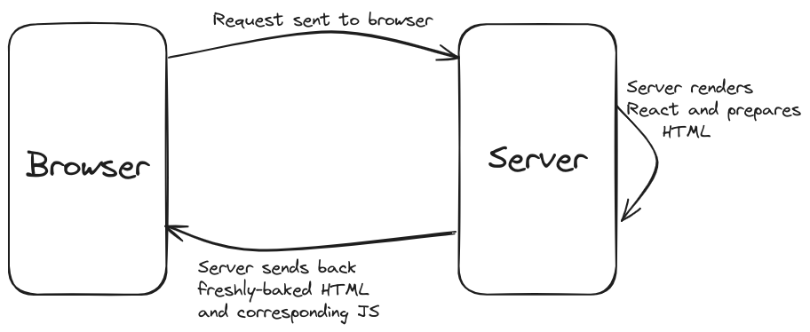
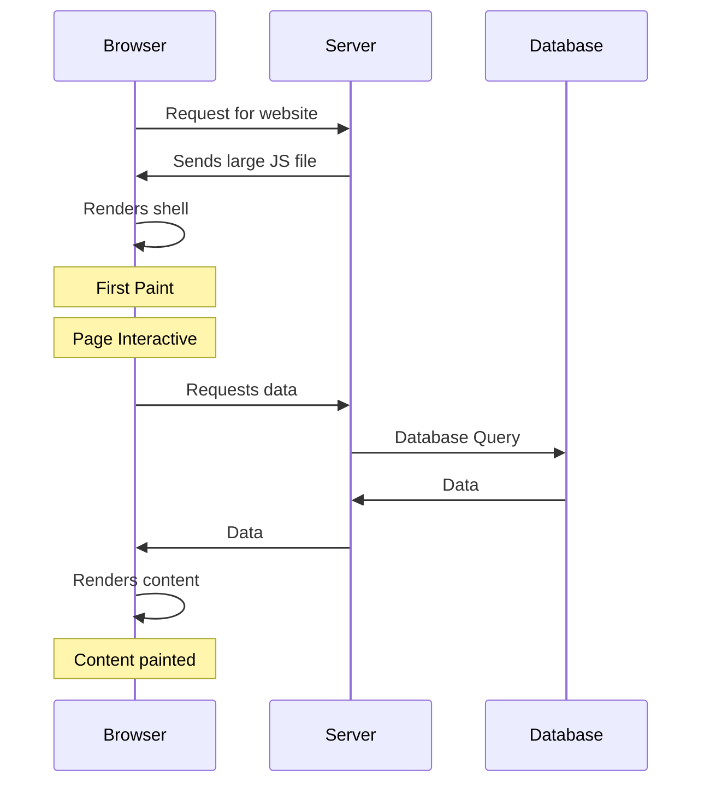
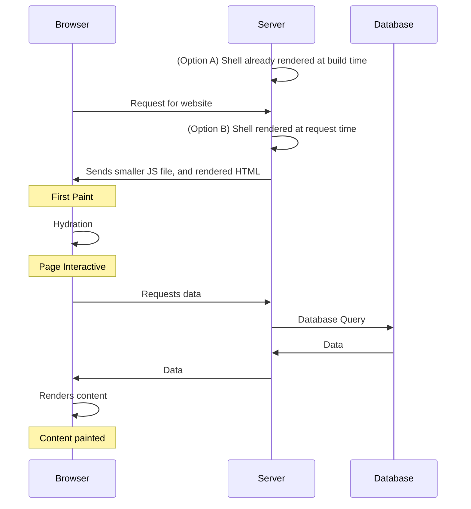
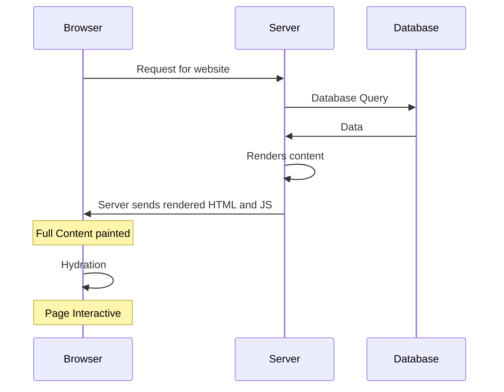
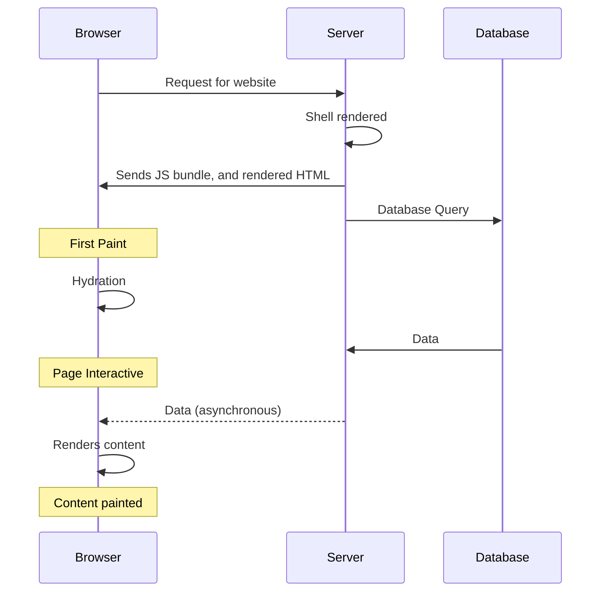

# Then vs Now: CSR vs SSR

When rendering a single-page application (SPA), how it has always worked is that the HTML file sent over the network has been mostly empty. Along with it there was usually a large javascript file (bundle) sent.

```html
<!DOCTYPE html>
<html>
  <body>
    <div id="root"></div>
    <script src="/index.js"></script>
  </body>
</html>
```

Once both the HTML and JS have been downloaded and parsed, React starts rendering the DOM nodes inside the empty `div` with the id "root". All while this happens the user is staring at a blank screen.

As the app grows, every few kbs you add to the bundle increases the time before which the user sees something tangible on the screen.

:::important
Always remember, one of the most taxing work done on the browser is the rendering and manipulation of the DOM using JS. If we can avoid that, it almost always leads to a boost in performance. This is the reason React uses a virtual DOM to track changes required before actually changing the real DOM.
:::

SSR aims to avoid exactly this. If we are able to directly send some html (with CSS obviously) to the browser:

- Not only is the work of rendering all the new DOM nodes no longer needed (which saves a lot of time)
- But also the user no longer has to look at a blank screen while the JS is downloaded and parsed.

One of the ways in which SSR can work:



Here the HTML (and hence DOM nodes) will already be present. But then when the attached JS bundle is downloaded and parsed, the code assumes control of the nodes. This process of adding interactivity and event handlers to HTML is called `hydration`.

:::note
There are other ways of conducting SSR too, one of them is to create the HTML files when the project is built in the first place. This is called Static Site Generation (SSG) and that is what makes this website possible!
:::

## Data fetching in React

This is how we normally fetch data in most React SPAs:



_Note: For context, shell is that empty loader boxes you see when data is yet to be fetched. I mean it's somewhat better to stare at a shell rather than an empty page, isn't it?_

Now... how can we improve this? One way would be to push off the simple task of rendering the shell to the server, or render it during build time!



The advantages of this are numerous:

1. The user sees the first paint as soon as it receives the HTML doc.
2. The user is able to interact with the page faster. Hydration is faster than first rendering! While one might say, "What interactivity? There's no content!", sometimes having semantic HTML tags provides enough interactivity, especially if the user is looking to navigate immediately to another page.
3. The JS file size is smaller because the code required to render the shell no longer needs to reach the browser.

In fact, we can go one step further...
Why not just call the database when we get the request and render the page with full content on the server itself! This might take a little more time on the server for the first call, with numerous advantages again:

1. Now, you might not have to put in the content-fetching logic in the bundle either. So even smaller bundle sizes!
2. The user can get started with working on the page extremely quickly, which means an amazing user experience.

:::note
There are caveats to this last approach, and is a decision to be made by the stakeholders involved.
:::

A potential flow for the same:



_Note: Hydration might still be required for any client-side interactivity needed in the application_

### Optional notes

#### New architecture

:::info
The proposed architecture in this section needs a few new features/paradigms in order to be implemented like React Server Components, Suspense and Streaming SSR architecture.
:::

There can be many interesting ways to solve the above problem, modern features even allow you to implement the following:


