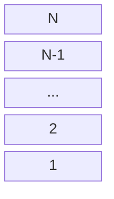

# Architectural Patterns

## Types of architectural structures

Just like one might have seen a lot of different diagrams in a software engineering class all describing the same software (eg. class, sequence, use-case diagrams), architectural structures can also be divided into 3 kinds. There describe the same software to be designed, but from different angles. These 3 types of structures are:

1. Module (or static) structures
2. Components and connectors (or dynamic) structures
3. Deployment structures

### Module Structures

Module strcutures examine how the software is divided into seperate static modules. They talk about how the application can be decomposed into multiple functionalities and how one module _uses_ others. Different modules can be abstracted over each other and this is called "layering". This is shown in the picture below.

### Component and Connector Structures

C&C structures examine how the system is constructed as a combination of behaviour (components) and interaction (connectors). Here the structure is focussed on how data flows through the system, what operations take place on it and where it is stored. The focus is on effective concurrecy, communication protocols, and how data is shared amongst the various parts of the system.

### Deployment Structures

Deployment structures describe how the software will interact with the non-software components around it. Essentially how it is developed and deployed, and takes into consideration things like running environments and modes of communication.
