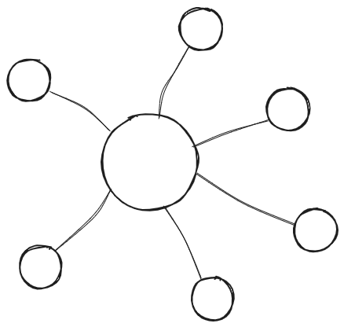

# Architectural Patterns

## Types of architectural structures

Just like one might have seen a lot of different diagrams in a software engineering class all describing the same software (eg. class, sequence, use-case diagrams), architectural structures can also be divided into 3 kinds. There describe the same software to be designed, but from different angles. These 3 types of structures are:

1. Module (or static) structures
2. Components and connectors (or dynamic) structures
3. Deployment (allocation) structures

### Module Structures

Module strcutures examine how the software is divided into seperate static modules. They talk about how the application can be decomposed into multiple functionalities and how one module _uses_ others. Different modules can be abstracted over each other and this is called "layering". This is shown in the picture below.

### Component and Connector Structures

C&C structures examine how the system is constructed as a combination of behaviour (components) and interaction (connectors). Here the structure is focussed on how data flows through the system, what operations take place on it and where it is stored. The focus is on effective concurrecy, communication protocols, and how data is shared amongst the various parts of the system.

### Deployment Structures

Deployment structures describe how the software will interact with the non-software components around it. Essentially how it is developed and deployed, and takes into consideration things like running environments and modes of communication.

## Centralized and Decentralized Systems

Centralized and decentralized architechture styles are 2 ways of thinking about the way systems are arranged. They both have their advantages and disadvantages.

### Centralized Systems

These systems have a central node responsible for assigning and coordinating tasks amongst the worker nodes. The owrker nodes do the actual work. Some centralized patterns include monolithic architecture, client-server architecture and layered architecture.

#### Characteristics

- **Global Clock**: The workers sync their clock with the central clock.
- **Single Server Node**: Just a single central node.
- **Failure**: If the central node fails, the entire network fails

#### Advantages

- Easy to implement security
- Easy to add and remove worker nodes, hence scalable
- Easy updates, as you only need to update central server

#### Disadvantages

- Single point of control causing multiple issues
  - Failure of central node cuases system to fail
  - If central node fails, there's no data replication or back-up so everything else will also fail
  - Difficult to perform maintainence on the central server without affecting everything around it.

### Decentralized Systems

Decentralized architectures don't rely on a central system to make it's decisions. Each node can make it's own decisions. While there is no central node, there can be multiple primary and secondary nodes where the primary nodes control the actions of the secondary nodes connected to it. Common architectures that rely on decentralized systems are peer-to-peer (P2P) arch and "publish and subscribe" architecture.

#### Characteristics

- Single node failure no longer affects the entire system!
- Work received can be divided amongst multiple servers
- No global clock

#### Advantages

- Load can be divided so we have no bottleneck
- Increased scalability and availability
- More fine grain control over resources consumed as each node has its own resources

#### Disadvantages

- A lot of overhead is required to compute task distribution, check node health and perform voting if required.
- More vulnerable to security risks

### Patterns

In the next few pages, we will discuss the various architecture patterns, with their features, advantages and disadvantages.
They are listed here:

- [Layered Arch](./layered.md)
- [N-Tier Arch](./n-tier.md)
- [MVC Arch](./mvc.md)
- [MVVM Arch](./mvvm.md)
- [Client-Server Arch](./client-server.md)
- [Peer to Peer Arch](./p2p.md)
- [Broker Arch](./broker.md)
- [Pipe and Filter Arch](./pipe-and-filter.md)
- [Event Driven Arch](./event-driven.md)
- [Publisher Subscriber Arch](./pub-sub.md)
