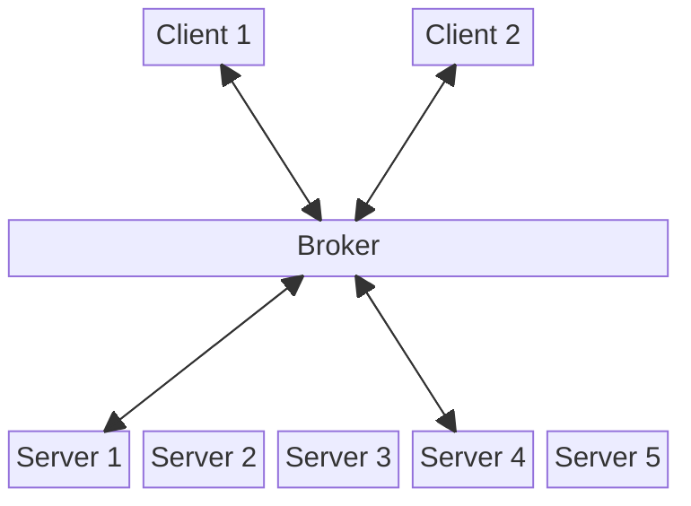

# Broker Architecture

A large software architecture with many running parts often is divided into sections offering a specific service. Now, how would the consumer of a service figure out the location of the service provider in order to communicate with them? You could write their locations in the code itself, but every time you the service provider, you will have to update the code of each and every consumer which is a headache!

So the main question is how can we design an architectural pattern that abstracts out inter-service communcation between the consumers and the providers? One solution to this is the broker architecture which introduces an intermediary which accepts requests from the client and forwards them to a server, and in turn forwards responses from the server to the client. So when we make changes to say the number of server nodes handling a particular type of request, we only need to change some configuration on the broker and now all client nodes will be able to send requests to the new server node (through the broker).

 

Brokers were first implemented in CORBA(Common Object Request Broker Architecture ). Today, brokers form an integral part of any service-oriented architecture. The broker design was also used in Enterprise Java Beans (EJB) and Microsoft .NET framework.

## Advantages of Broker Architecture

- Decoupling between service providers and consumers helps ensure that changes can be made to these components more independently.
- Flexibility is also increased as now altering some broker code can help make changes to the flow of requests and data.
- Brokers can also act as firewalls and prevent unauthorized access of resources by consumers thus increasing security.
- Brokers can act as load-balancers thus making the system more reliable and scalable.
- Brokers may improve performance of the system as the individual functional systems of the application do not have to focus on communication.

## Disadvantages of Broker Architecture

- Development and implementation of a broker can be complex. (One can use existing broker implementations).
- The intermediate communication and routing through a broker does have a performance overhead.
- Broker might be point of failure for the application, if the broker is down the services become inaccessible.
- Due to the additional layer of abstraction, troubleshooting issues might be more difficult especially when we have to trace out the path of a particular request.
