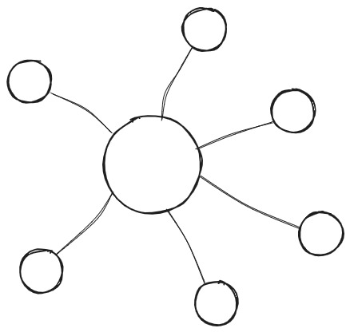

# Client-Server Architecture

Client-Server Architecture is a 2-layered (and usually 2-tiered) architecture. The clients either requests data from the server or uses a service that the server provides. A single server can have many clients connected to it.

If the server contains most of the business logic, the client can be referred to as a thin client. And if the client contains most of the business logic, the client is called a full-featured client.

This arch has been used in multiple places in the technologies that currently surround us:

- A majority of the internet relies on client-server architecture to serve websites.
- Emails rely on SMTP servers to be sent correctly

## Advantages of Client-Server Architecture

- **Performance**: Since the tasks can be divided between the server and the client, if we divide them well we can boost performance of the application greatly.
- **Scalability**: We can add/remove clients as we require.
- **Security**: Since the clients do not have access to all the data, they are more secure from malicious attackers.
- **Resource management**: Since the data and resources are centralized it is much easier to manage, maintain and update them.

## Disadvantages of Client-Server Architecture

- **Central point of failure**: The server is a central point of failure, so if the server goes down, the entire application goes down.
- **Network Dependencies**: If the network is down, the client can't communicate with the server, hence being affected.
- **Complexity**: Complex as it requires us to maintain seperate client and server logic (especially if the client isn't a thin client!)
