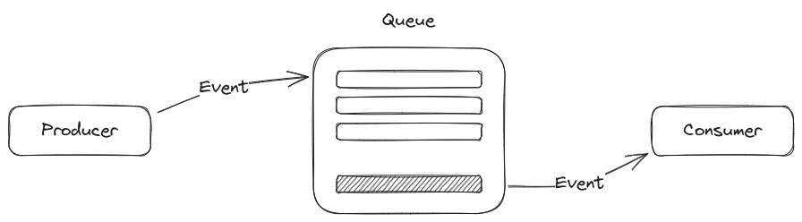

# Event Driven Architecture

In event driven architecture, components of the system by sending and receiving events rather than calling each other's functions or API. This is an asynchronous method of communication.

## Common terms in Event-Driven Architecture

- **Webhooks**: Used to send a "notification" to other systems when a certain event occurs.
- **Message Queues**: Used to store messages/events from the producer, until they are ready to be processed by the consumer. We can have multiple consumers to take data from a queue, and that's where load-balancing comes in.
- **Event Source**: Anything that generates events
- **Event Bus**: Anything responsible for transporting an event from source to sink. Could be a queue or a specialized load-balancer.
- **Event Sink**: Anything that consumes events

## Advantages of Event-Driven Architecture

- **Decoupling**: Components in an event driven architecture are loosely coupled, making the system easier to maintain and flexible.
- **Asynchrony**: Events aren't immediately attended to, and once an event has been emitted the producer can focus on other tasks. This asynchrony allows for better throughput as components aren't blocked at any point.
- **Scalability**: The number of consumers can be increased and be load-balanced, thus increasing scalability.
- **Reusability**: If a certain service's functionality needs to be reused, it can simply accept events from many other services. Email-sending service is a good example.

## Disadvantagse of Event-Driven Architecture

- **Ordering**: Since the events are in a queue with many consumers, there can be no ordering guarantee on the way events are processed. If events need to be processed in a certain order, then this can be quite complex.
- **Complexity**: Any new arch component like message queue, or load-balancer will add to the complexity and development time of the system.
- **Debugging**: It often becomes difficult to debug the path followed by an event in the system.
- **Latency**: Any sort of intermediary like a broker or queue will cause latency to increase in the system.
