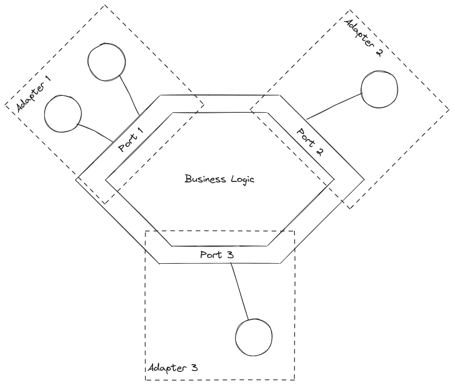

# Hexagonal Architecture

Hexagonal Architecture also known as ports and adapters architecture, in which the core functionality (business logic) of the application is seperated from the external dependancies of the system (like databases, other services and external APIs). This is to provide a clear seperation of the business logic from the components that connect the application to the abstract world. For example, let's take a stock market analysis application, here the business logic can be (should be) seperated out from the thin client UI. This allows the functionality to be tested seperately than the UI and this decoupling allows both codebases to grow independently as long as they agree on a single API.

## Terms related to Hexagonal Architecture

- **Core domain**: Represent the core business logic. This is seperated from the rest of the infrastructure and has no knowledge how everything else is implemented.
- **Adapters**: These connect the core domain to the external components like databases, web services and UIs.
- **Ports**: These actually define the protocol/interface (kinda like the API) the external systems must implement in order to communicate with the core domain.
- **Driver**: The actualy components that implement the required ports.

## Applications of Hexagonal Architecture

- Web applications may abstract out core domain functionalities and have a seperate thin client UI to just display what is required.
- Mobile applications are especially a good example, as mobile devices aren't usually powerful enough to implement a lot of the business logic.
- Sometimes a microservice is used to abstract out business logic, so that it can be shared amongst many other services.
- Such architecture allows a single application to have many interfaces at the same time, like GUI, CLI and web-based applications.

## Advantages of Hexagonal Architecture

- Makes it easier to unit test core domain seperately from external dependancies.
- Promotes creation of modular code that can be changed as required without affecting the implementation of other components.
- Allows multiple way to use business logic, through CLI, GUI or web-based applications.

## Disadvantages of Hexagonal Architecture

- Can add complexity and development time to the application as you have to implement adaptors and drivers.
- Maintaining and understanding the codebase can be difficult for developers new to the project.
