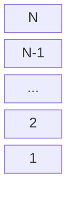
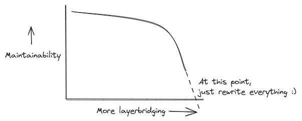

# Layered Architecture

The system is built as a set of layers or abstractions over each other. Typically, a module on a certain layer can only access the abstractions offered by layer(s) below it. Each layer provides a consistent set of services and API which needs to be documented correctly.

## Open Layers, Closed Layers and Layer Bridging

Ideally, a layer can only use the API exposed by the layer under it. This makes it easy to maintain as at a time you only have to worry about one layer at a time.

**Closed layers** are layers that one has to pass through for further work to be processed. Having a stack of closed layers helps maintainability as each layer only caters to the layer above it. One doesn't need to care about what changes are made to layers above it.

With **open layers** we have more freedom to cross layers. A module on Layer A could use code from Layer C for a more "fine-grained" access and this is called **layerbridging**. But this quickly increases the complexity of the program, as when you change something in Layer C, now you have to care about how its API is being used in both Layer A and B. As the program grows and more and more layers get bypassed, the complexity may increase exponentially, leading to major issues while maintaining the codebase.

## Advantages of a layered architecture

- Seperation of concerns helps us understand and deal with each layer seperately.
- Reduced complexity as you no longer have to think about the entire codebase while making changes, just the layers directly above and underneath it.
- Code becomes more extensible
- If we deploy each layer of the application seperately, we can scale each layer up and down seperately. This increases throughput and availabilty and even security (cause firewalls can be installed between layers).
- Easier to reuse certain functionality as all functionality of the lower layer can be accessed by the one above it.

## Disadvantages of a layered architecture

- For many of the changes (Especially when you're adding new features), all layers need to be changed. This is especially an issue if the layers are deployed (and/or versioned) seperately.
- Extra code for intercommunication of layers.
- Sometimes, splitting the application into multiple layers has more monetary costs and may affect performance due to the time required for inter-layer communication.
