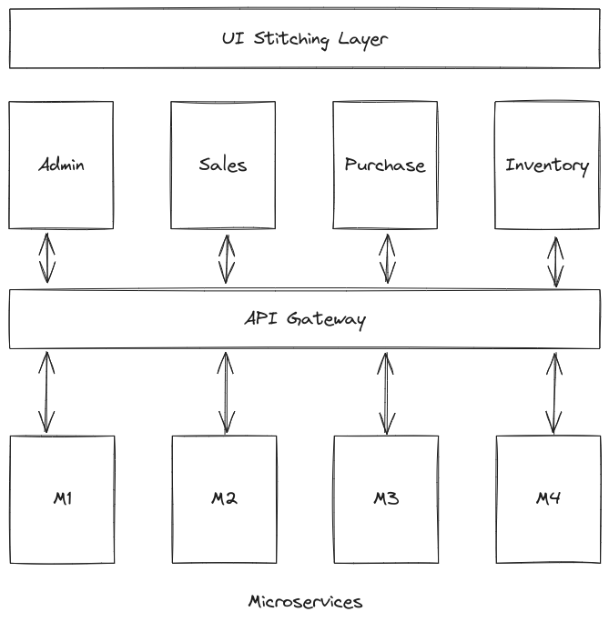

# Microfrontends

The microfrontend architecture involves the breaking down of the frontend of a website/application into smaller, independent components, or "micro-frontends". It is similar to microservices but it is applied to the frontend of the application rather than the backend.

## When to use Microfrontends Architecture

- Big sophisticated applications that require a high amount of frontend scalability and maintainability.
- Frontend applications that are expected to grow and evolve over time.

## Advantages of Microfrontends Architecture

- **Scalability**: Microfrontends can be scaled (CDN/code-splitting/lazy-loading) independently of each other.
- **Maintainability**: Changes to one microfrontend doesn't mean other microfrontends need to be changed.
- **Ease of testing**: Microfrontends being seperate components can be tested independently of each other.
- **Flexibility**: Seperate components can be combined and reused in whatever manner required, hence adding to the flexbility of the architecture.

## Disadvantages of Microfrontends Architecture

- **Complexity**: As the various parts of the frontend architecture increase in number the entire system gets more and more complex. This increases development time, cost and effort and also needs more complex architecture for inter-communication.
- **Increased Overhead**: All the communication and coordination overhead can impact system performance.
- **Difficulty Debugging**: With so much intercommunication going on between components, it can get difficult to debug issues in the system.
