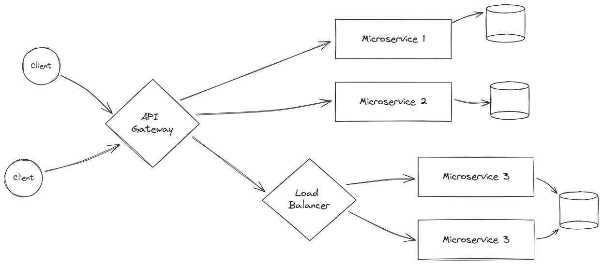

# Microservices Architecture

Microservices Architecture involves the splitting up of the software system into multiple smaller sized components that can be developed and deployed seperately. The aim of the microservices architecture is to improve the scalability, flexibility and maintainability of a system by splitting up into individual testable components.

## Components of Microservices Architecture

- **Microservices**: Smaller independent components of an application which are designed to perform a specific task. They communicate with other microservices through well defined APIs.
- **API Gateway**: This sits between the client and the microservices and performs the task of routing client requests to the appropriate microservice. Additionally it can also perform authentication, authorization and rate-limiting.
- **Service registry**: This maintains the list of microservices currently operating. This allows the API gateway to route the requests to the correct microservice.
- **Load Balancer**: Distributes service requests between multiple microservices of the same type, ensuring good performance, high availability and good scalability.
- **Database**: System for storing and organizing data. Each microservice usually has its own database ensuring scalability.

## Advantages of Microservices Architecture

- **Scalability**: Individual microservices can be scaled up or down as needed.
- **Maintainability**: Since each component can be updated independently as long as communication is intact, it is more maintainable.
- **Flexiblity**: The overall software becomes more flexible as the microservice can be reused and repurposed as required.
- **Testability**: Individual microservices can be tested independently. This can save time and effort when testing or debuggin an application.

## Disadvantages of Microservices Architecture

- **Complexity**: When a large application has a lot of smaller parts interacting with each other the complexity grows quite a bit, so it might be difficult to coordinate the development of these parts.
- **Increased Overhead**: Because microservices are independent components that need to interact well with each other, there is a lot of communication and infrastructure overhead involved.
- **Difficult to Debug**: A lot of independent components with many messages passing between each other and through load-balancer, it can become difficult to debug.

## When to use Microservices

1. When we have large, complex application with a requirement for scalability and maintainability.
2. When the application is expected to grow overtime in functionality and scale.

## Monolithic vs. Microservices

<table style={{width:"80%"}}>
    <tr>
        <td></td>
        <th>Monolithic</th>
        <th>Microservices</th>
    </tr>
    <tr>
        <th>Complexity</th>
        <td>Simpler to understand, debug and deploy</td>
        <td>Quite complex to understand, debug and deploy the whole system</td>
    </tr>
    <tr>
        <th>Scalability</th>
        <td>Difficult to scale as components are tightly coupled</td>
        <td>Microservices can be scaled independently as needed</td>
    </tr>
    <tr>
        <th>Maintainability</th>
        <td>Difficult to just make changes to one component as everything is tightly coupled</td>
        <td>Microservices can be extended and changed as needed</td>
    </tr>
    <tr>
        <th>Flexibility</th>
        <td>Difficult to reuse and repurpose individual components</td>
        <td>Microservices can be reused and repurposed as needed</td>
    </tr>
    
</table>

