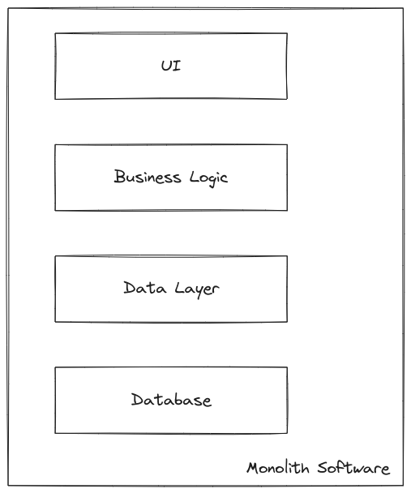

# Monolithic Architecture

The architecture of a software system with all of its componenets very tightly connected and interdependant is referred to as monolithic architecture. This includes the UI, business logic and data storage. It was the most commonly used architecture for the most amount of time, until microservices came along.

## Advantages of Monolithic Architecture

- **Simplicity**: A single codebase makes it easy to understand for the developers.
- **Ease of deployment**: Everything is deployed at the same time and in the same place, so the deployment is much simpler.
- **Ease of testing**: Since everything is integrated together, it is easier to test the code written.
- **Better performance**: Less latency is introduced as the inter-component communication is very quick.

## Disadvantages of Monolithic Architecture

- **Difficult to scale**: Since the components are very tightly coupled, it is very difficult to scale monolith architecture.
- **Difficult to maintain**: As the size of the codebase increases, it becomes difficult to keep track of every component, making it difficult to maintain.
- **Limited Flexibility**: Since components are tightly coupled it is difficult to make changes to or improve only one component.
- **Needs commitment to single technology**: Switching technologies or programming language in a monolithic architecture isn't possible, but possible in microservices as it allows you to maintain the services in a different codebase and deployment environment.

:::note
Monolithic Architecture is most suitable for small or medium size applications that don't need extensive scalability options and don't need frequent updates or modifications.

As the application size and requirements increase, one can consider using microservice or serverless patterns instead as they are more appropriate for handling the challenges of maintainability or scalability.
:::
