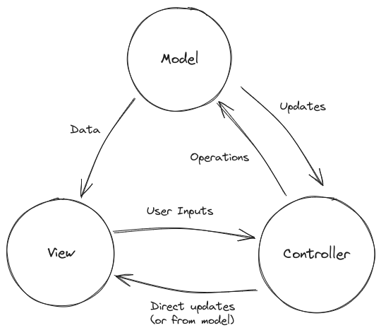

# Model-View-Controller (MVC) Architecture

An architecture pattern where the application is divided into 3 parts.

1. **Model**: The part of the application representing the data and the available operations (business logic) over the data.
2. **View**: The user interface part of the application. It takes the data from the model and displays it to the user in a suitable way. Usually it is in the form of web pages (HTML, CSS, and JS), but that may not be the case.
3. **Controller**: Responsible for handling user interactions. It takes requests from the view, processes them and sends them to the model. The model then performs the necessary operations and sends the data back to the controller, which forwards it to the view to be displayed.

MVC Architecture Diagram

MVC is designed to provide a clear seperation of concerns between these three components, which allows this to be more modular. We can even extend this basic architecture with more services and/or layers depending on our needs (like maybe we also need to connect with a third party API or different security needs or something like caching).

## Advantages of MVC

The separation of concerns into M,V and C helps improve code reusability, testability and flexibility.

## Disadvantages of MVC

Increased overhead due to extra abstraction. Everything the user does must go through the controller, even basic CRUD operations. (This had both advantages and disadvantages).
