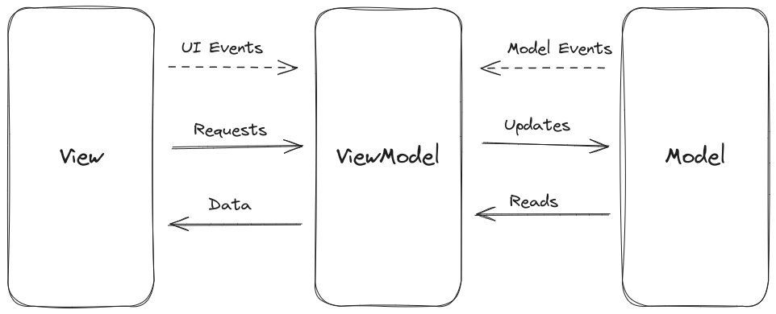

# Model-View-View-Model (MVVM) Architecture

Somewhat similar to MVC arch, but now the Model is completely abstracted away from the View through the ViewModel. The functionality of the 3 parts now is:

- **View**: UI functionality for the end user. Sends user requests to the ViewModel.
- **ViewModel**: Takes requests from the views and passes onto the model, and takes data from the model and passes it to the view. Also passes on model events and passes on the same to the view.
- **Model**: Represents the data and the business logic of the application.

## Advanteages of MVVM

- Better seperation of concerns than MVC hence better extensibility, code reuse and testability.
- Better support for applications that automatically update when data changes (this is called data-binding)

## Disadvantages of MVVM

- More code is needed for defining data binding and data change event communication, reducing maintainability.
