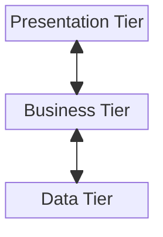

# N-Tier Architecture

N-Tier or multitier architecture rely on the application being split up into multiple phases/tiers. Tiers refer to physical partitions and are often used in conjunction with multilayered application where each tier deploys a particular layer, although this might not be the case.

When we look at each tier with respect to the logic they implement they become a C&C pattern, and if we look at the tiers with respect to how they interact with the env, then it becomes a deployment pattern.

One example of a multi-tier architecture.

## Tiers vs Layers

The two ideas may seem very closely related (in fact they are often used together!) but they mean differnt things. **Layers** are logical seperation in the codebase which aids maintainability and extensibility, wheras **Tiers** are physical seperation of parts of the code, so that it is easier to scale and secure applications. Hence multiple layers can exist on a single system, but tiers do not.

In recent years, there has been a rise in web applications using the 3-tier architecture, instead of the old 2-tier client-server architecture. The 3-tiers are:

1. Data Tier: Provides access and control over the persistent storage like RDBMS.
2. Business Tier: Provides functionality to implement business logic like business rules, validations and data calculations.
3. Presentation Tier: A thin client with which the end-user interacts. Important feature of this tier is its usability!

## Advantages of multitier architecture

- **Scalability**: Each tier can be scaled independently and hence provides more scalability and helps reduce bottlenecks.
- **Flexibility**: Seperate tiers aid flexibility as we can now extend the application in multiple ways.
- **Security**: Eg. Since the presentation tier now needs the business tier to access the data, it would be harder for attackers to directly access sensitive data. Additionally each layers can be secured seperately with authentication now.

## Disadvantages of multitier architecture

- **Complexity**: When these tiers are deployed differently (or worse even versioned differently), it becomes very cumbersome to make changes to all the tiers at the same time.
- **Performance Overhead**: Inter-tier communication adds a performance overhead that may affect user experience.
- **Costs**: Additional deployment and network costs may be incurred.
