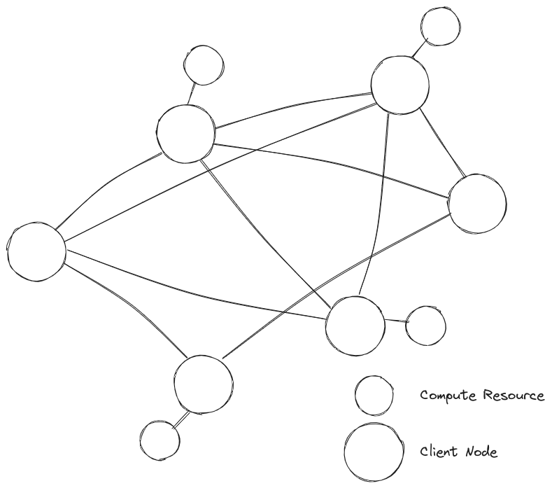

# Peer to Peer Architecture (P2P)

Unlike client-server architecture, in P2P architecture there is no centralized authority that makes decisions and distributes workloads. Nodes in the system can act as both client and server. All workload is distributed (mostly) equally in the system. Each node both contributes to the resources of the system and also consumes the resources of other nodes, with the exception of edge nodes which only consume resources in the system.

There are different kinds of P2P arch:

- **Pure**: All nodes are equal
- **Hybrid**: Some notes have special responsiblity like configuration management, controlling communication between nodes and resource and task allocation.
- **Structured**: The nodes are structures in such a way that allows easy distribution of resources and tasks.

Peer to Peer Architecture Diagram

## Applications of P2P Architecture

- **File-sharing and messaging**: P2P networks are used to create networks that make it easy to share files and messages between nodes in a network. This has been used by applications like Whatsapp.
- **Distributed Computing**: Used by many distributed computing applications to setup a "cluster" of nodes.
- **IoT**: P2P devices can directly communicate with each other.

There are many more applications I have not elaborated here like online gamings, decentralized currencies, decentralized cloud storage.

## Advantages of P2P Architecture

- Since the servers are decentralized, there is grater availability and fault tolerance as there is no central server.
- More scalable than client-server architecture as not every request needs to be routed through a centralized server as the number of nodes on the system grow.
- Offers greater privacy as other (possibly compromised) nodes cannot know about the communication between other nodes.
- Lower costs as we don't need to obtain and maintain specialized server infrastructure.

## Disadvantages of P2P Architecture

- Less secure as nodes can be compromised and turn malicious, thus possibly affecting the security of the whole system. This is especially true if each node is not properly secured.
- Coordination between seperate nodes can be a big overhead and can degrade performance as compared to a client-server architecture.
- Quality of service can be affected as there is no central authority to solve issues or faults in the system when they arrive
