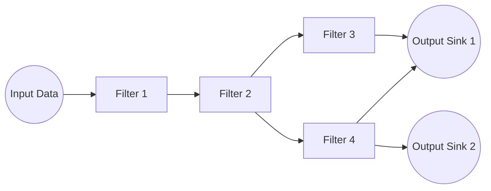
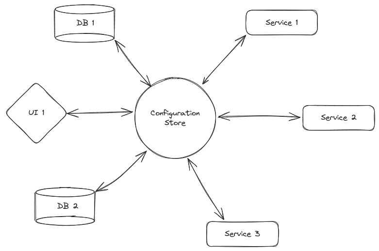

# Pipe and Filter Architecture

Sometimes it can be advantageous to think of a system as a series of transformations on data one after the other. Each transformation can be understood as a standalone and reusable component. These transformations can be combined in whatever order is required. The pipe and filter architecture is a simple architecture useful for representing data pipelines where each filter performs a specific transformation on its input data and passes along the output to the next filter through a pipe.

## Shared Data Pattern

The shared data pattern is a variant of pipe and filter which involves a single shared central repository of data that is accessed by many services. This is often used in security and configuration management scenarios.

## Applications of Pipe and Filter

- Large scale data pipelines
- Streaming data pipelines
- Image editing software
- IoT
- Text processing (spell-check and grammar-check)

## Advantages of Pipe and Filter

- **Modularity**: Individual modules can be changed and swapped easily
- **Scalability**: Allows for parallel computation of data
- **Maintainability**: Easier to troubleshoot if we maintain a good logging system

## Disadvantages of Pipe and Filter

- **Overhead**: These pipe and filter abstractions may cause greater overhead due to serialization and communication protocols used.
- **Complexity**: A lot of initial setup may be required to get modularize the code into seperate components
- **Lack of adaptability**: Error handlling may be difficult for many static pipelines, especially if it is an unexpected error.
