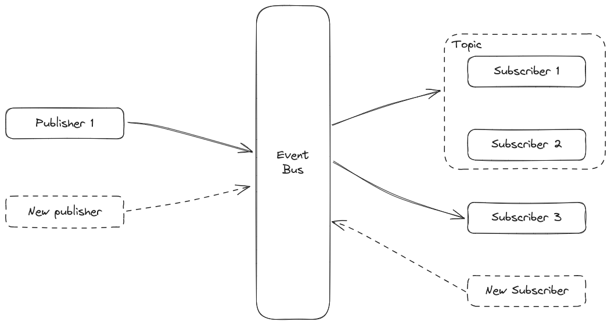

# Publisher Subscriber Architecture

This is a slight variation over the event-driven architecture. Here, instead of having events specifically sent to a particular target, the information is related to multiple components who have "subscribed" to that information. There are 3 important terms related to this architecture.

- **Publishers**: The entities producing the event information.
- **Subscribers**: The entities consuming the event information.
- **Event bus**: The component of the system responsible for transporting the events from the publishers to the subscribers.

There is a certain dynamic nature to the publishers and subscribers. Depending on the architecture of the system, one or more subscribers/publishers may be added/removed during the course of operation of the system. The event-bus is a more central bus as compared to a single message queue, and can perform operations on the messages like topic-filtering and content-filtering.

## Applications of Publisher Subscriber Architecture

- **Event-Driven Systems**: Where a single event is consumed by a large number of subscribers. For example, change in stock price might trigger many systems that perform market predictions.
- **Messaging Systems**: Dynamic group-messaging systems might require this kind of arch.
- **IoT**: Data analysis software might subscribe to a lot of IoT sensors through this system.
- **Triggering services**: This arch can be used a triggering mechanism for many on-prem and cloud services/microservices.

## Advantages of Publisher Subscriber Architecture

- Decoupling allows us to change and update both systems independently.
- Flexibility, vecause it allows easy addition and removal of publisher and subscribers.
- If we use complex message routing patterns, it is also scalable with many subscribers without affecting system performance.
- Asynchronous communication doesn't let the components get blocked, hence increasing throughput.

## Disadvantages of Publisher Subscriber Architecture

- Complex to initially set up and may take up development time.
- Some performance overhead, especially important if not optimized well.
- Routing rules may get very complicated, especially if need to route messages to very specific subscribers.
- Failure on the message broker or subscriber's side can cause loss of messages.
