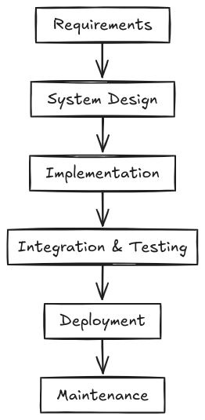

# Architecture and SDLC

Architecture speaks about how the various major parts of the software are divided amongst each other and subsequently interconnected.

## Waterfall method

System architecture design is an important part of the software creation process andit must be done early in the development lifecycle.

  

However the waterfall method is not at all flexible, and the design of the system must be done at once without any way to iterate on it.

## Agile

Many companies have shifted to Agile which is much more incremental and iterative. But then that brings up the question, at what point should the architecture of the project be decided? The answer to this is rather simple! Like we develop code in an Agile way, the system arch should also grow incrementally. The arc should be such that it supports the current set of features well and is also further extensible as the project evolves. The final software architecture "emerges" out of the increasing requirements of the project.
